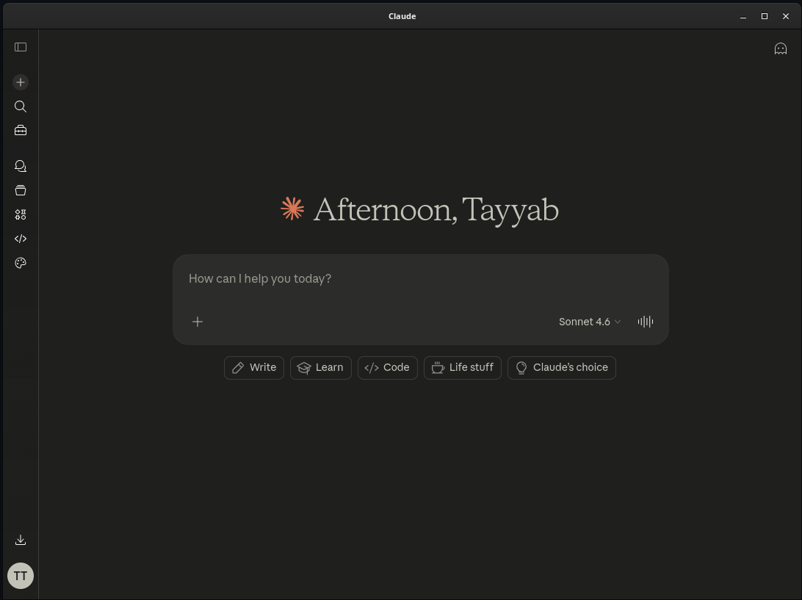

# Claude Desktop

An unofficial, lightweight desktop client for [Claude AI](https://claude.ai) built with Electron. Designed for Linux — works on Fedora, Ubuntu, Arch, and any distro that supports Flatpak.



## Features

- Full Claude AI interface in a native desktop window
- Wayland and X11 support (auto-detected — works great on Fedora/GNOME)
- Desktop notifications support
- Google Sign-In opens in your system browser for security
- Right-click context menu with image-saving support
- Single-instance enforcement — re-focuses existing window on relaunch
- Hardware-accelerated rendering

## Installation

### Flatpak (recommended)

Works on Fedora, Ubuntu, Arch, and any Linux distro with Flatpak support.

```bash
flatpak install flathub io.github.tayyabtahir143.ClaudeDesktop
flatpak run io.github.tayyabtahir143.ClaudeDesktop
```

### Build from source (Flatpak)

Requirements: `flatpak-builder`, `git`, `python3-pip`, `nodejs`, `npm`

```bash
git clone https://github.com/tayyabtahir143/claude-desktop
cd claude-desktop/flatpak

./setup.sh         # Install runtimes and generate npm sources (run once)
./build.sh --run   # Build and launch
```

### Run with npm (development)

```bash
git clone https://github.com/tayyabtahir143/claude-desktop
cd claude-desktop
npm install
npm start
```

## License

MIT — see [LICENSE](./LICENSE)
